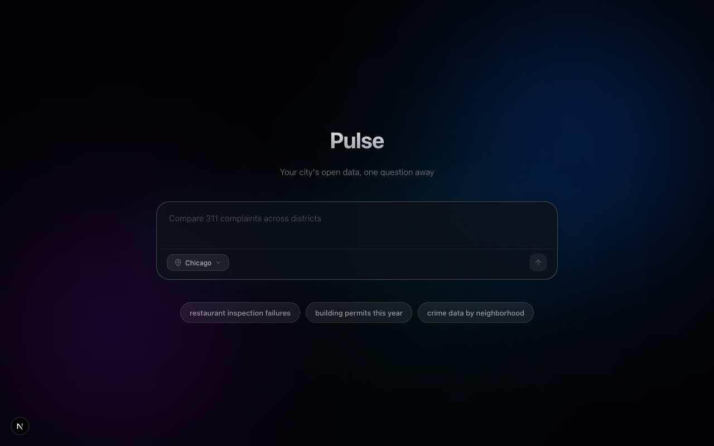

# Pulse

An AI-powered chat interface for exploring open government data. Ask questions in plain English and get answers from real Socrata open data portals — complete with tables, charts, and CSV exports.

Built with Next.js, Vercel AI SDK, and Claude.



## Features

- **Natural language queries** — ask about city data the way you'd ask a coworker
- **Multi-portal support** — switch between Chicago, NYC, San Francisco, Seattle, Boston, Austin, LA County, and New York State
- **Live data** — searches, inspects, and queries Socrata datasets in real time via SoQL
- **Rich results** — data tables, bar charts (Recharts), and one-click CSV export
- **Context sidebar** — shows the active dataset, columns, and applied filters
- **Suggestion chips** — contextual follow-up prompts after each response
- **Glass morphism UI** — dark-themed interface with animated glow effects

## Tech Stack

| Layer | Tech |
|-------|------|
| Framework | Next.js 16 (App Router) |
| AI | Vercel AI SDK v6 + Claude Sonnet 4 |
| Styling | Tailwind CSS v4 + shadcn/ui + Radix |
| Charts | Recharts |
| Data | Socrata Open Data API (SODA) |
| Language | TypeScript, React 19 |

## Getting Started

```bash
npm install
npm run dev
```

Open [http://localhost:3000](http://localhost:3000).

### Environment Variables

Create a `.env.local` file:

```
ANTHROPIC_API_KEY=your-api-key
```

## Project Structure

```
src/
├── app/
│   ├── api/chat/route.ts        # AI streaming endpoint
│   ├── page.tsx                  # Main page (hero + chat)
│   └── layout.tsx
├── components/
│   ├── chat/                     # Chat input, messages, suggestions
│   ├── data/                     # Tables, charts, dataset cards
│   ├── sidebar/                  # Context sidebar
│   └── ui/                       # shadcn/ui primitives
├── lib/
│   ├── socrata/                  # API client, tools, MCP client
│   ├── prompts/                  # System prompt builder
│   ├── session/                  # Session state (context, provider)
│   └── utils/                    # Chart helpers, CSV export
└── types/
    └── index.ts
```

## How It Works

1. User asks a question and selects a Socrata portal
2. The chat route streams the query to Claude with Socrata tool definitions
3. Claude decides which tools to call — `search_datasets`, `get_dataset_info`, or `query_dataset`
4. Tool results flow back through the AI SDK stream and render as rich UI components
5. The context sidebar updates with the active dataset and filters

## License

MIT
